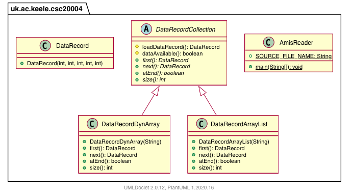

# Practical1: Implementing our own dynamic array

This repository contains the stub code for Practical 1, whose goal is to read the contents of a tabular data file in a data structure that needs to grow dynamically.

The repository contains the initial code for two possible implementations:
* a traditional array, that is copied over a bigger one as needed
* an ArrayList

The following UML diagram shows the hierarchy of the provided classes:

You may want to refer to the documentation for the [Java APIs](https://docs.oracle.com/en/java/javase/11/docs/api/index.html) when trying to decide which is the most appropriate data structure to use.
In particular, refer to the [Java Collections framework](https://docs.oracle.com/en/java/javase/11/docs/api/java.base/java/util/package-summary.html#CollectionsFramework).
